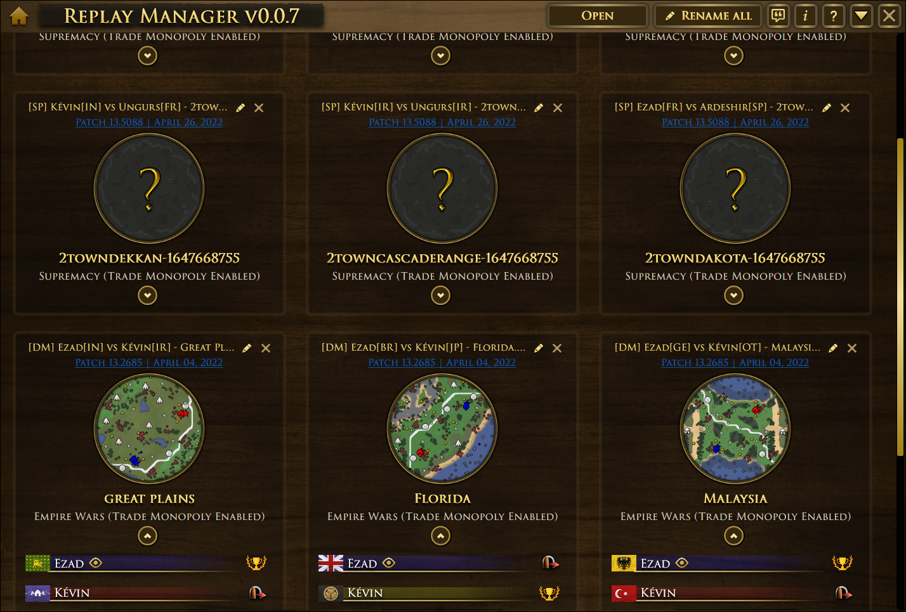

<!-- PROJECT LOGO -->
 

  

# Replay Manager

*Tool to viewing Age of Empires III: Definitive Edition records*

**Developer:** VladTheJunior 
**Current version:** 0.0.1 
[Download Portable (.zip archive)](https://github.com/VladTheJunior/ReplayManager/releases/latest/download/ReplayManager.zip) 

## Table of Contents

* [About the Project](#about-the-project)
* [Screenshots](#screenshots)
* [License](#license)
* [Contact](#contact)
* [Acknowledgements](#acknowledgements)

<!-- ABOUT THE PROJECT -->
## About The Project

Replay Manager is an update to Records Parser tool from ESO Tracker developed in 2019 for Legacy version of Age of Empires 3. It shows most of the useful information needed to analyze recorded game. 
Due to the different file structures between Legacy and DE, some features (such as game actions) could not be migrated immediately and require extensive testing and development. 
If you have information or desire to help in testing or development, then leave a message in the topic on the official forum or DM me in Discord.

**Features:**
* Shows general info about recorded game (title, map, game mode, game version, players, civs).
* Shows ALL (even not used) players decks with ability to make a screenshot.
* Shows list of all important game actions(train units, build, shipment, spawn unit, research tech, selected deck, resigned, cheat tech) with timestamp. - **In development**
* Renaming game records. - **In development**
* Shows game summary (winner, apm counter). - **In development**

## Screenshots

<!-- LICENSE -->
## License

Distributed under the MIT License. See `LICENSE` for more information.

<!-- CONTACT -->
## Contact

VladTheJunior - Discord: VladTheJunior#1244 - VladTheJunior@gmail.com

Project Link: [https://github.com/VladTheJunior/ReplayManager](https://github.com/VladTheJunior/ReplayManager)

<!-- ACKNOWLEDGEMENTS -->
## Acknowledgements
* [VladTheJunior/ESO-Tracker](https://github.com/VladTheJunior/ESO-Tracker)

Special thanks to:
* [ESO-Community](https://eso-community.net/) and in particular **@Buckethead** for sharing code and explanations.
